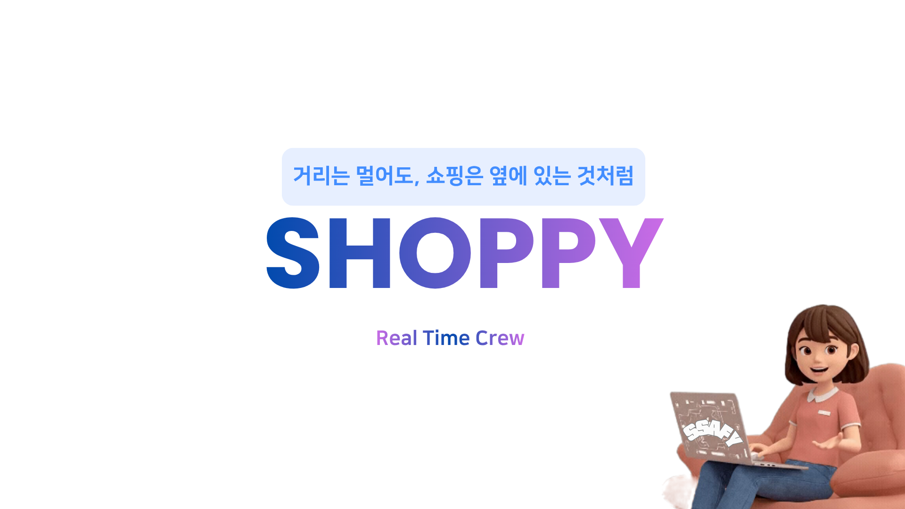
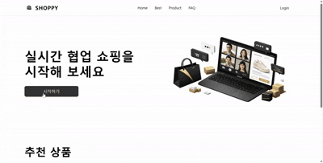
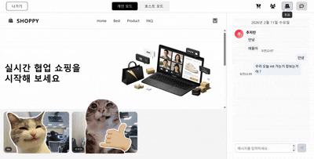
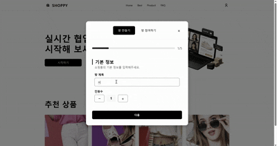
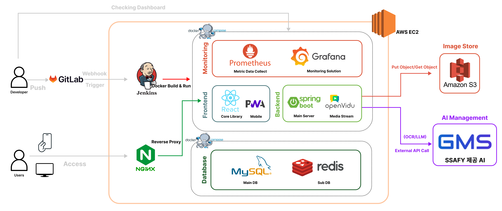
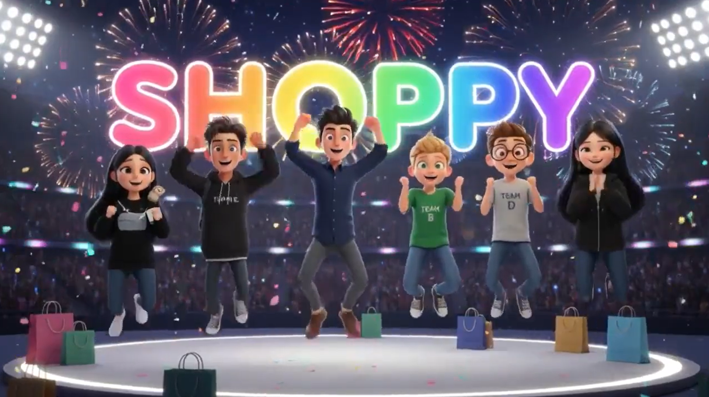
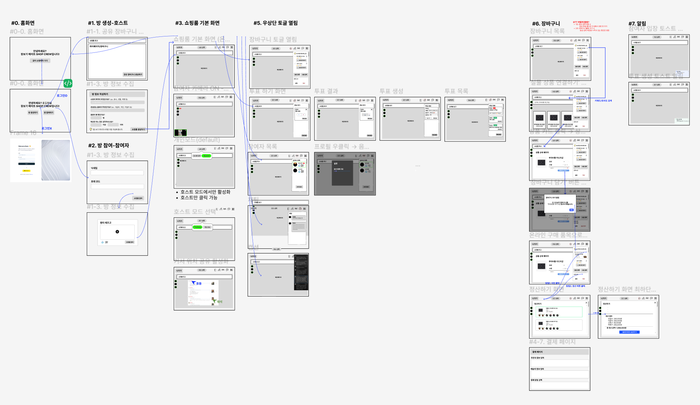
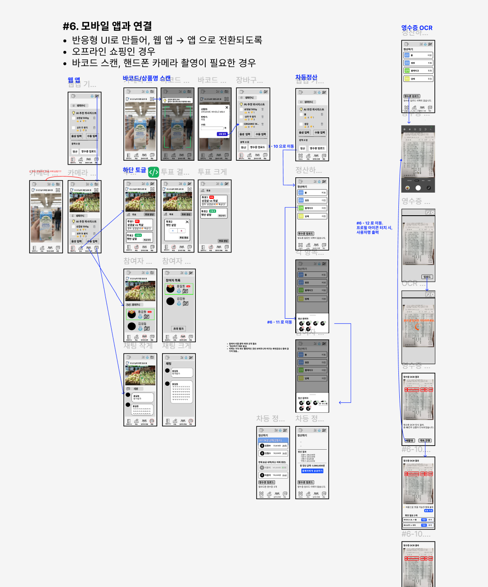
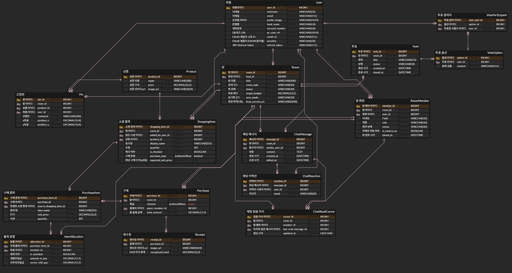

<!-- ============================================ -->
<!--        🛒 Shoppy — 쇼피 README           -->
<!-- ============================================ -->

<p align="center">
  
</p>

<h1 align="center">🛒 Shoppy — 쇼피</h1>

<p align="center">
  <b>실시간 화상 채팅 기반 쇼핑 플랫폼</b>
</p>

<p align="center">
  
  
  
  
  
  
  
  
</p>

- **개발 기간** : 2026.01.12 ~ 2026.02.06 **(4주)**
- **플랫폼** : Web (PWA 지원, 반응형 웹)
- **개발 인원** : 6명
- **기관** : 삼성 청년 SW 아카데미 14기 (공통 프로젝트)

---

## 🔎 목차

<div align="center">

### <a href="#intro">📌 프로젝트 소개</a>

### <a href="#background">💡 기획 의도 / 배경</a>

### <a href="#developers">🌟 팀원 구성</a>

### <a href="#features">✨ 주요 기능</a>

### <a href="#techStack">🛠️ 기술 스택</a>

### <a href="#architecture">🏗️ 시스템 아키텍처</a>

### <a href="#quickstart">🚀 빠른 시작</a>

### <a href="#directories">📂 디렉터리 구조</a>

### <a href="#troubleshooting">🔧 트러블 슈팅</a>

### <a href="#deliverables">📦 프로젝트 산출물</a>

</div>
<br>

## 📌 프로젝트 소개

<a name="intro"></a>

<b>Shoppy(쇼피)</b>는 온라인 쇼핑의 편의성과 오프라인 쇼핑의 즐거움을 결합한 <b>실시간 화상 채팅 기반 플랫폼</b>입니다.

기존의 온라인 쇼핑에서는 링크를 공유하고, 의견을 물어보고, 답변을 기다리는 단절된 경험이 불가피했습니다. 
Shoppy는 웹 브라우저 상의 실시간 화면 동기화와 화상 통화를 결합하여, **친구와 오프라인에서 나란히 화면을 보며 장바구니를 함께 채우는 경험**을 온라인에 완벽히 구현했습니다.

> 💡 **"같이 보고, 같이 고르고, 똑똑하게 정산하자!"** - 실시간 화면 동기화 + OpenVidu 화상 대화 + AI 기반 영수증 정산의 올인원 패키지

---

## 💡 기획 의도 / 배경

<a name="background"></a>

### "쇼핑은 원래 친구랑 수다 떨면서 하는 게 제맛인데..."

코로나19 이후 온라인 커머스는 급격히 성장했지만, <b>"쇼핑의 본질적인 즐거움"</b>인 소통과 공유의 과정은 오히려 축소되었습니다.

메신저를 통해 사고 싶은 물건의 링크를 끊임없이 주고받으며 피로감을 느끼는 사용자들, 여러 명과 함께 여행이나 파티 물품을 공동 구매할 때 번거로운 정산 과정에 불편함을 호소하는 사람들을 위해 Shoppy는 시작되었습니다.

### Shoppy의 접근법

| 기존 온라인 쇼핑 | Shoppy (쇼피) |
|---|---|
| 링크 캡처 및 전송 | **같은 화면, 같은 위치(스크롤/커서) 실시간 공유** |
| 메신저 타이핑 | 얼굴을 마주 보는 **화상 및 음성 채팅** |
| 각자 계산 후 수동 정산 | AI OCR 기반의 **스마트 영수증 정산 자동화** |

---

## 🌟 팀원 구성

<a name="developers"></a>

<div align="center">
<table>
    <tr>
        <td width="33%" align="center">
             <br>
            <b>김민상</b> <br>팀장 (Backend & Infra) <br>
        </td>
        <td width="33%" align="center">
             <br>
            <b>김민우</b> <br>팀원 (Backend) <br>
        </td>
        <td width="33%" align="center">
             <br>
            <b>송주헌</b> <br>팀원 (Backend) <br>
        </td>
    </tr>
    <tr>
        <td width="280px">
            <sub>
                - 프로젝트 리딩 <br>
                - 인프라 및 배포 파이프라인(Jenkins) 구축 <br>
                - 모놀리식 백엔드 아키텍처 설계 <br>
                - RoomService (WebSocket) 실시간 업데이트 <br>
            </sub>
        </td>
        <td width="280px">
            <sub>
                - OpenVidu (WebRTC) 연동 <br>
                - 화상 채팅 코어 API 개발 <br>
                - 방(Room) 기반 세션 생명주기 관리 <br>
                - 핵심 비즈니스 로직 구현 <br>
            </sub>
        </td>
        <td width="280px">
            <sub>
                - 주요 비즈니스 API 연동 개발 <br>
                - Spring Security + JWT 인증 로직 <br>
                - OAuth2 소셜 로그인 구현 <br>
                - RESTful API 아키텍처 설계 <br>
            </sub>
        </td>
    </tr>
</table>

<table>
    <tr>
        <td width="33%" align="center">
             <br>
            <b>송이룸</b> <br>팀원 (Frontend) <br>
        </td>
        <td width="33%" align="center">
             <br>
            <b>기장선</b> <br>팀원 (AI) <br>
        </td>
        <td width="33%" align="center">
             <br>
            <b>추지인</b> <br>팀원 (Frontend) <br>
        </td>
    </tr>
    <tr>
        <td width="280px">
            <sub>
                - WebSocket (STOMP) 프론트 연동 <br>
                - 사용자 커서 및 스크롤 실시간 동기화 <br>
                - 재사용 가능한 공통 컴포넌트 개발 <br>
                - 반응형 웹(PC/Mobile) 디자인 적용 <br>
            </sub>
        </td>
        <td width="280px">
            <sub>
                - 영수증 텍스트 탐지 및 OCR 연동 <br>
                - GPT mini 4.1 API 프롬프팅 최적화 <br>
                - AI 정산 결과 데이터 보정 로직 구현 <br>
                - LLM 모델 파이프라인 연동 <br>
            </sub>
        </td>
        <td width="280px">
            <sub>
                - 서비스 메인 UI/UX 기획 및 디자인 <br>
                - Zustand를 활용한 전역 상태 관리 <br>
                - OpenVidu 프론트엔드 통합 연동 <br>
                - 화상 채팅 인터페이스 및 장바구니 UI <br>
            </sub>
        </td>
    </tr>
</table>
</div>
<br>

---

## ✨ 주요 기능

<a name="features"></a>

### 🛒 같이 사요 (Real-time Sync)

오프라인에서 함께 쇼핑하는 듯한 완벽한 동기화 경험을 제공합니다.

<div align="center">
  <table>
    <tr>
      <td align="center"></td>
      <td align="center"></td>
    </tr>
    <tr>
      <td align="center"><b>실시간 커서 위치 공유</b></td>
      <td align="center"><b>화면 스크롤 동기화</b></td>
    </tr>
  </table>
</div>

> 💡 **실시간 장바구니**: 내가 상품을 담으면 방 안의 친구들 화면에도 즉각적으로 반영됩니다.

### 📹 얼굴 보고 사요 (Video Chat)

링크 하나로 친구들을 간편하게 초대하고 얼굴을 마주하며 대화할 수 있습니다.

<div align="center">
  
  <br><br>
  <b>간편한 방 생성 및 초대</b>
</div>

> 💡 **다자간 화상 통화**: OpenVidu 기반의 실시간 화상 채팅을 통해 생생한 대화를 나눌 수 있습니다. (※ 시연 이미지 생략)

### 🧾 똑똑하게 사요 (Smart Settlement)

함께 쇼핑하고 난 뒤의 복잡한 비용 정산도 AI가 깔끔하게 해결해 줍니다.

> 💡 **스마트 영수증 정산**: 영수증 사진을 업로드하면 GPT 기반 인공지능이 항목을 자동으로 분류하고, 참여자별 맞춤 정산 내역을 즉시 생성합니다. (※ 시연 이미지 생략)

---

## 🛠️ 기술 스택

<a name="techStack"></a>

### 📱 Frontend

<div align="center">


| **Category** | **Stack** |
| :---: | :---: |
| **Framework** | React 18, Vite |
| **Styling** | TailwindCSS |
| **State Management** | Zustand |
| **Real-time** | WebSocket (STOMP), OpenVidu (WebRTC) |

</div>

### ⚙️ Backend

<div align="center">


| **Category** | **Stack** |
| :---: | :---: |
| **Language** | Java 17 |
| **Framework** | Spring Boot 3.x |
| **Security** | Spring Security 6.x, JWT 인증 |
| **Database** | MySQL 8.0, Spring Data JPA |
| **AI API** | OpenAI GPT mini 4.1 API |

</div>

### 🛠 DevOps & Infra

<div align="center">


| **Category** | **Spec** |
| :---: | :---: |
| **Server** | AWS EC2 |
| **Container** | Docker |
| **CI/CD** | Jenkins |
| **Web Server** | Nginx |

</div>
<br>

---

## 🏗️ 시스템 아키텍처

<a name="architecture"></a>

<div align="center">



</div>

### 핵심 설계 포인트

| 설계 요소 | 구현 방식 | 효과 |
|-----------|----------|------|
| **실시간 동기화** | WebSocket (STOMP) `RoomService` | 사용자의 스크롤/커서 좌표를 Room 세션 단위로 실시간 브로드캐스팅 |
| **데이터 비동기** | 쇼핑/장바구니 API는 RESTful 유지 | `ShoppingService`는 REST로 무상태 유지, 실시간 이벤트는 소켓 채널로 논리적 분리 |
| **화상 스트리밍** | OpenVidu (WebRTC) SFU | P2P 대비 다자간 통화 시 클라이언트 부하를 최소화하는 안정적 연결 |

---

## 🚀 빠른 시작

<a name="quickstart"></a>

### 사전 요구사항

- **Java** 17  /  **Node.js** 18+  /  **Docker** & **OpenVidu Server**

### 1단계: 저장소 클론

```bash
git clone https://lab.ssafy.com/s14-common/SHOPPY.git
cd SHOPPY
```

### 2단계: 백엔드 서버 실행

```bash
cd SHOPPY-BE
# application-secret.yml 또는 환경 변수(.env) 세팅 필요
./gradlew clean build
./gradlew bootRun
```

### 3단계: 프론트엔드 앱 실행

```bash
cd SHOPPY-FE
npm install
npm run dev
```

---

## 📂 디렉터리 구조

<a name="directories"></a>

<details align="left">
  <summary>
    <strong>📦 Backend (Spring Boot API)</strong>
  </summary>

```
SHOPPY-BE/src/main/java/com/shoppy/
├── 📂 auth/             # 인증 및 OAuth2 (JWT)
├── 📂 room/             # 화상 채팅 방 및 세션 관리 (WebSocket)
├── 📂 shopping/         # 상품 검색 및 장바구니 관리 (REST)
├── 📂 webrtc/           # OpenVidu 연동 및 미디어 라우팅
├── 📂 ai/               # OCR 및 OpenAI GPT mini 연동
└── 📂 user/             # 사용자 정보
```
</details>

<details align="left">
  <summary>
    <strong>📱 Frontend (React / Vite)</strong>
  </summary>

```
SHOPPY-FE/src/
├── 📂 components/       # 재사용 가능한 UI 컴포넌트
├── 📂 pages/            # 라우팅 페이지 (메인, 쇼핑룸, 정산 등)
├── 📂 store/            # Zustand 전역 상태 저장소
├── 📂 hooks/            # 커스텀 훅 (WebSocket, WebRTC)
├── 📂 assets/           # 폰트, 이미지 등 정적 파일
└── App.jsx
```
</details>
<br>

---

## 🔧 트러블 슈팅

<a name="troubleshooting"></a>

<details>
  <summary><strong>장바구니 로직의 실시간 동기화 지연 문제</strong></summary>

  - **문제**: 사용자가 장바구니에 아이템을 담았을 때, REST API 응답 대기 후 WebSocket으로 이벤트를 전파하다 보니 다른 사용자 화면에 반영되는 속도가 늦어짐 (체감 레이턴시 증가).
  - **원인**: 모놀리식 구조에서 `ShoppingService`의 DB Write 작업 완료를 기다린 후 `RoomService`로 메시지를 던지는 동기적 파이프라인.
  - **해결**: 클라이언트에서 장바구니 추가 동작 발생 시 WebSocket 채널로 "장바구니 추가 중(Optimistic UI)" 이벤트를 먼저 브로드캐스팅. DB 처리는 비동기로 백그라운드 처리하고 최종 실패 시에만 롤백 브로드캐스팅 전송.
</details>

<details>
  <summary><strong>다자간 화상 채팅 시 화면 끊김 (WebRTC)</strong></summary>

  - **문제**: 한 방에 4명 이상 접속 시 화상 연결이 뚝뚝 끊기거나 레이턴시가 급증하는 현상 발생.
  - **원인**: 초기 구현 시 P2P(Mesh) 구조로 연동하여 클라이언트 당 업로드 트래픽이 `(N-1)` 배열로 늘어나 기기 성능 저하를 유발함.
  - **해결**: OpenVidu 인프라를 활용하여 서버 기반의 **SFU(Selective Forwarding Unit)** 구조로 전환. 클라이언트는 자신의 영상만 서버로 올리고, 서버가 다른 참여자의 영상을 분배해줌으로써 대역폭 부하를 획기적으로 개선함.
</details>

---

## 📦 프로젝트 산출물

<a name="deliverables"></a>

<h3><a href="https://drive.google.com/file/d/1va5ubtdNcQOpqOnAVWs8z-fOh01GNMLE/view?usp=drive_link" target="_blank">📹 Video Portfolio</a></h3>
<div align="center">

<a href="https://drive.google.com/file/d/1va5ubtdNcQOpqOnAVWs8z-fOh01GNMLE/view?usp=drive_link" target="_blank">
  
</a>

<br><br>
<sub>▲ 클릭하면 구글 드라이브에서 영상을 볼 수 있습니다</sub>

</div>
<br>

<h3>🎨 화면 설계서 (Figma)</h3>
<details align="left">
  <summary><strong>웹 (Web) 화면 설계</strong></summary>
  <div align="center">
  
  </div>
</details>
<details align="left">
  <summary><strong>모바일 (App) 화면 설계</strong></summary>
  <div align="center">
  
  </div>
</details>

<h3>🗄️ ERD</h3>
<div align="center">
  
</div>

<h3>✅ 관련 문서</h3>
<p>
  <ul>
    <li><a href="https://drive.google.com/file/d/1oK6YZZaYA6WJrGhrInsK5QoB-9IqJGqE/view?usp=drive_link" target="_blank">API 명세서</a></li>
    <li><a href="https://www.figma.com/design/zLF5mji4j6nNTF10R8CGjP/%EA%B3%B5%ED%86%B5PJT-C209-SHOPPY?node-id=0-1&t=e7SLkJ5yTDHXdA4t-1" target="_blank">화면 설계서 (Figma)</a></li>
  </ul>
</p>

---

<p align="center">
  Copyleft 2026. <b>Shoppy Team</b>. All wrongs reserved.
</p>
